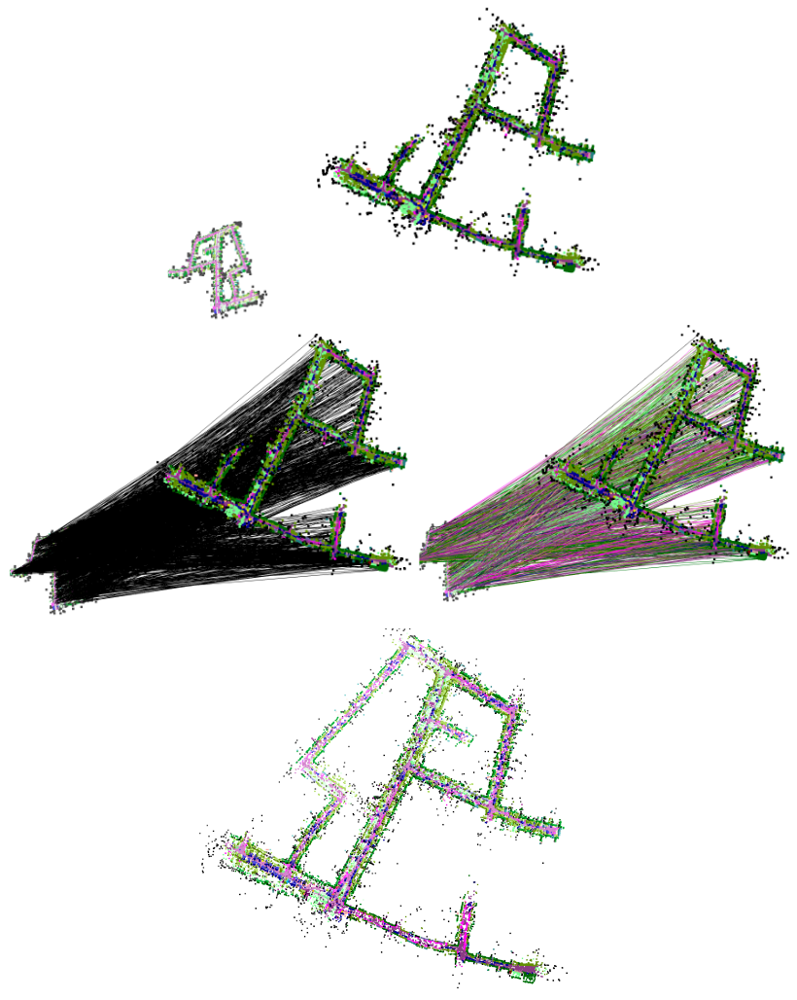
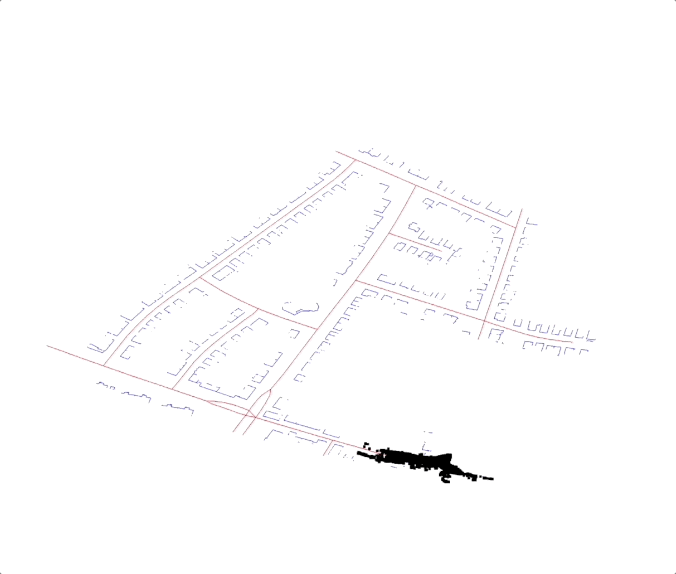

- The code in create\_semantic\_maps directory is a bunch of separate scripts I have been experimenting with to create global semantic maps from lidar scans, align with OSM data, and then relabel.

<p align="center">
  
  
  <!--  -->
</p>

# Lidar2OSM: Distributed Urban Mapping with Bandwidth-Efficient Geospatial Descriptors 📡🗺️🤖

This repository supports a project investigating the feasibility of converting raw lidar scans into OpenStreetMap (OSM)-style representations for distributed multi-robot operations. The aim is to empower autonomous robot teams to efficiently generate and accurately share low-dimensional maps of their environments, particularly in bandwidth-limited urban areas with constrained GPS signals.

The sheer complexity of LiDAR data, with its high-dimensional semantic richness, could introduce noise or irrelevant details that don't actually help with multi-robot map matching but instead make the process more difficult. This difficulty becomes exacerbated when considering transient objects and varying observational perspectives. Counterintuitively, utilizing OSM-style data, though simpler, might highlight the key features that are most useful for peer-to-peer map associations without overwhelming an underlying algorithm. The maximum clique technique is particularly effective at exploiting these core relationships in the filtered data.

<div align="center">
  
</div>

### Included Projects

This repository includes the `semantic_clipper` project, which is based on work originally developed by the MIT Aerospace Controls Lab. The code is used under the MIT License, and the original license is included in the `semantic_clipper/` directory.

## CU-MULTI Dataset

<!-- There are a limited number of datasets available that use a mobile ground-based robot in urban scenarios with both accurate GPS data, lidar, and IMU. It is for this reason we demonstrate our findings on two major on-road datasets, KITTI-360 and NuScenes. However, we fill this gap with the CU-MULTI Dataset, a multimodal dataset collected in an off-road urban environment containing **INSERT NUMBER** LiDAR scans and 6,235 images. -->

There are a limited number of datasets available that use a mobile ground-based robot in urban scenarios with both accurate GPS data, lidar, and IMU. It is for this reason we demonstrate our findings on two major on-road datasets, KITTI-360 and NuScenes. However, we fill this gap with the CU-MULTI Dataset, a multi-robot dataset collected in an off-road urban environment consisting of two large environments on the University of Colorado Boulder's Main Campus.

## Map-matching with Semantic-CLIPPER
### Building/Installing Semantic-CLIPPER

In order to make use of semantic-clipper, you will need to build it using `cmake`:

```bash
$ cd semantic_clipper
$ mkdir build
$ cd build
$ cmake ..
$ make
$ sudo make install
```

Once successful, the C++ tests can be run with `./test/tests` (if `-DBUILD_TESTS=ON` is added to `cmake ..` command).

### Installing Python Bindings and use within the supplied Conda env

If Python bindings are built (see configuration options below), then the `semantic_clipper` Python module will need to be installed before using. This can be done with

```bash
$ cd semantic_clipper/build
$ make pip-install

# or directly using pip (e.g., to control which python version)
$ python3 -m pip install bindings/python # 'python3 -m' ensures appropriate pip version is used
```

A Python example notebook can be found in [`examples`](examples/python).

### Configuring the Build

The following `cmake` options are available when building CLIPPER:

| Option                  | Description | Default |
|-------------------------|---------------------------------------------------------------------------------------------------------------------------------------------------------------------------------|---------|
| `BUILD_BINDINGS_PYTHON` | Uses [`pybind11`](https://github.com/pybind/pybind11) to create Python bindings for CLIPPER                                                                                     | `ON`    |
| `BUILD_BINDINGS_MATLAB` | Attempts to build MEX files which are required for the MATLAB examples. A MATLAB installation is required. Gracefully fails if not found.                                     | `OFF`    |
| `BUILD_TESTS`           | Builds C++ tests                                                                                                                                                                | `OFF`    |
| `BUILD_BENCHMARKS`      | Builds C++ timing benchmarks                                                                                                                                                                | `OFF`    |
| `ENABLE_MKL`            | Attempts to use [Intel MKL](https://software.intel.com/content/www/us/en/develop/tools/oneapi/components/onemkl.html) (if installed) with Eigen for accelerated linear algebra. | `OFF`   |
| `ENABLE_BLAS`           | Attempts to use a BLAS with Eigen for accelerated linear algebra.                                                                                                               | `OFF`   |

**Note:** The options `ENABLE_MKL` and `ENABLE_BLAS` are mutually exclusive.

These `cmake` options can be set using the syntax `cmake -DENABLE_MKL=ON ..` or using the `ccmake .` command (both from the `build` dir).

### Testing Semantic-CLIPPER on data

There are example scripts to test the semantic-CLIPPER algorithm in examples/semantic_clipper.
